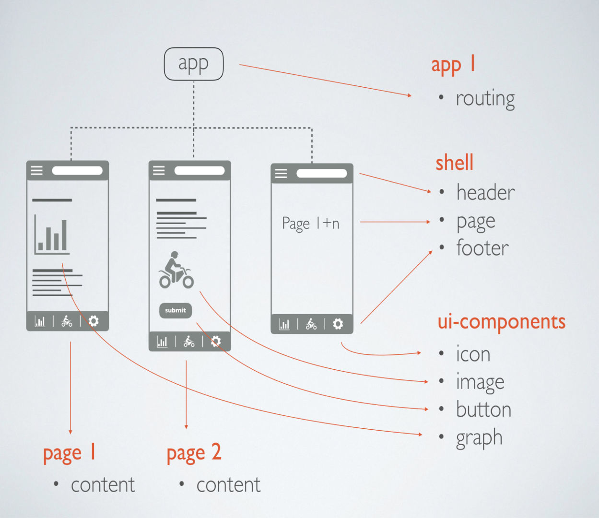
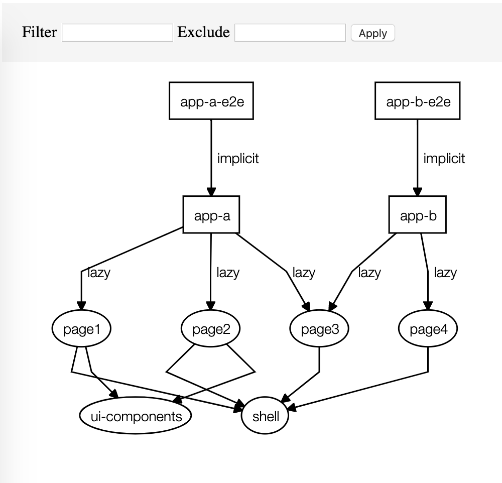
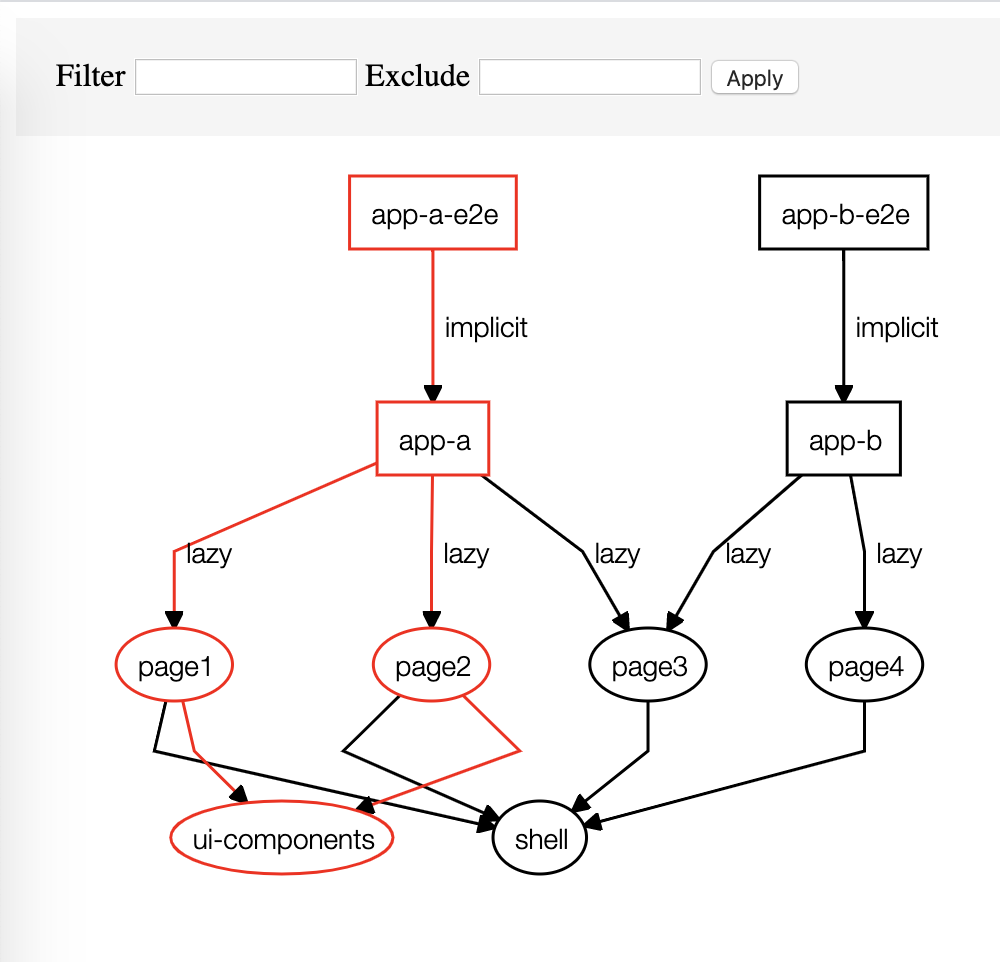

# Experiment with NRWL NX (version 8)

## Goal:

See how NRWL NX works and how it can help in your development process.

## General:

NRWL NX has a setup for Angular, React and Web. In this repo I worked with the Angular version.

### NX documentation

- [Nx Documentation](https://nx.dev/angular)
- [10-minute video showing all Nx features](https://nx.dev/angular/getting-started/what-is-nx)
- [Interactive Tutorial](https://nx.dev/angular/tutorial/01-create-application)

## Setup:

2 simple apps consist of multiple _pages_, a _shell_ and an _ui_ library.
We use this setup to see how NRWL NX projects depends on each other and how the `affected` scripts work.

The image above shows the project where each orange header is a NX project.

## Dependencies:

With NX you can see the the dependency graph for you project with `& yarn dep-graph` (see image).

## Affected dependencies:

When you change code in 1 of the projects, NX can determine which other projects are affected by the code change. The images below shows all the affected apps when changing something in the ui-components library.

With the knowledge which libraries are affected, you/NX can optimize the CI pipeline because it only needs to run the tests and quality checks for the projects that are actually affected by the code change(s).

## Presentation:

See nrwl-nx-presentation.key for more details for this experiment.
